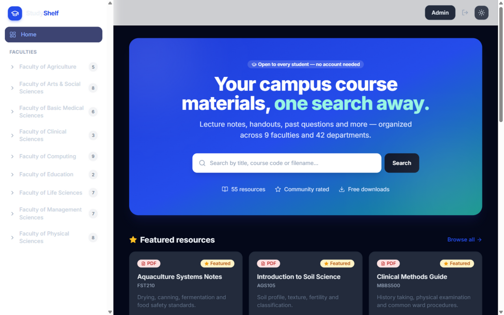
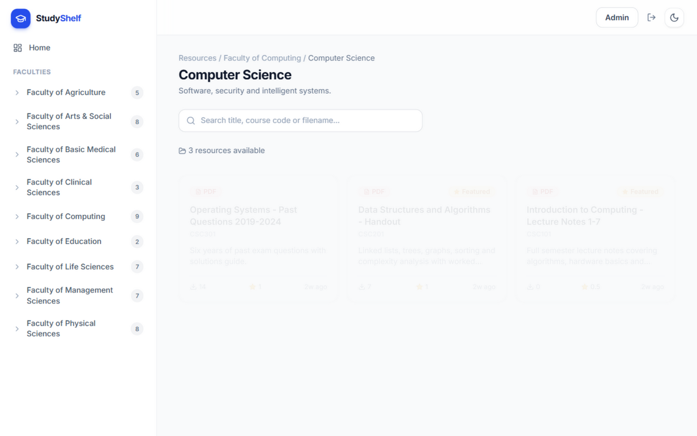
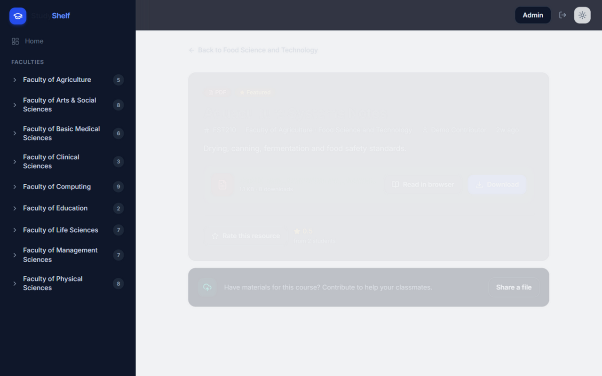
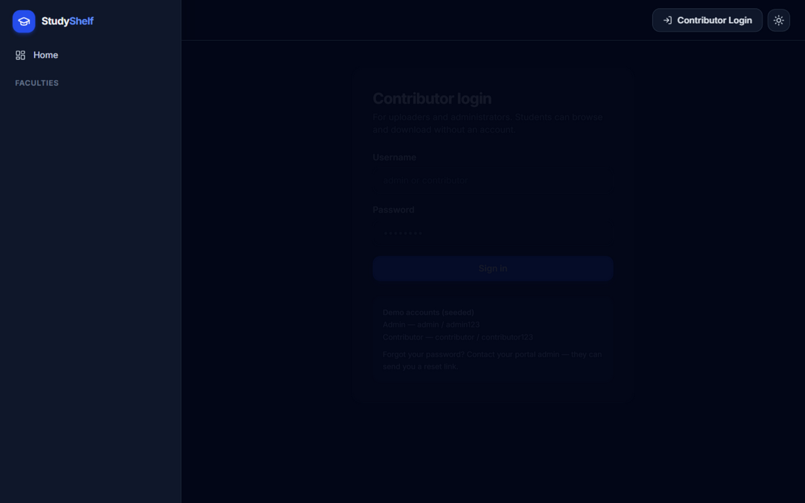
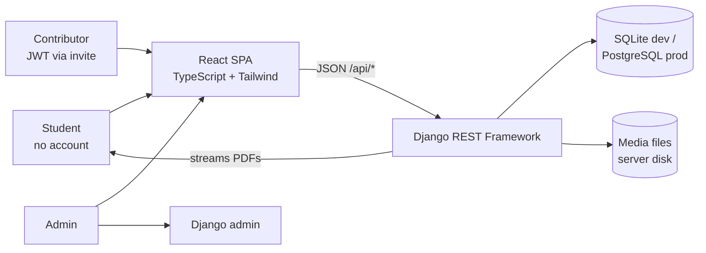

# 🎓 StudyShelf

[](https://github.com/YOUR_GITHUB_USERNAME/studyshelf/actions/workflows/ci.yml)


A modern academic resource portal where students browse, **read PDFs
in-browser**, and download course materials organized by faculty and
department — **no student account needed**. Uploads are restricted to
**contributors** who are invited by the administrator through one-time,
expiring invite links.

Built as a single-origin Django + React application: one server, one deploy,
zero CORS.

## Screenshots

| Home | Browse by faculty → department |
|---|---|
|  |  |

| Resource detail (dark) | Contributor dashboard | Admin dashboard |
|---|---|---|
|  |  |  |

## Why I built it this way — the engineering story

This project is deliberately documented like a production system. Every
significant choice is written up as an [Architecture Decision Record](docs/adr/)
— 13 of them — including the alternatives considered and the tradeoffs
accepted. A few highlights:

- **Zero-friction students, governed uploads** — students never sign up
  (no PII collected at all); contributors exist only through
  cryptographically-random, one-time, expiring invite links the admin shares
  manually ([ADR-002](docs/adr/ADR-002-auth-and-invite-onboarding.md)).
- **Honest anti-spam** — anonymous upvotes are rate-limited per browser via
  localStorage, and the docs say exactly how that's bypassable and what the
  server-side upgrade is ([ADR-003](docs/adr/ADR-003-localstorage-client-state.md)).
- **Single-origin serving** — Django serves the React build, the REST API,
  uploaded media and the admin panel from one origin, with a catch-all route
  that 404s missing assets instead of silently returning HTML — a blank-page
  failure mode I hit, root-caused, and wrote a regression test for
  ([ADR-006](docs/adr/ADR-006-single-origin-spa-serving.md)).
- **The test suite is the regression net** — 42 backend tests covering auth,
  the invite lifecycle, upload permissions, resource ownership, the password
  reset lifecycle, download counting and admin filters. Writing them caught
  four real bugs, including an anonymous-user 500 and admin deletes that
  orphaned files on disk.
- **Infrastructure YAGNI** — no Celery, Redis, or email server in v1; every
  deferral has a written revisit trigger instead of a vibe
  ([ADR-007](docs/adr/ADR-007-no-background-workers-v1.md)).
- **Open-core strategy** — this repo is the generic core; institutional
  deployments are private forks with their own hardening
  ([ADR-011](docs/adr/ADR-011-open-core-plus-institutional-fork.md)).

## Architecture



Deep dive: [docs/ARCHITECTURE.md](docs/ARCHITECTURE.md) — container diagram,
data model, request lifecycles (browse, invite→register, batch upload), and an
honest trust-boundary list.

## ✨ Features

- **Public browsing & downloads** — no login required for students
- **Read in browser** — PDFs render on the page (native viewer); images too
- **Faculty → Department navigation** — 9 faculties, 42 departments, live counts
- **Search** across title, course code, filename and description
- **Batch uploads** — drag & drop, per-file validation, live progress
- **Invite system** — one-time, 7-day expiry, revocable; admin shares links manually
- **Contributor dashboard** — personal impact stats; edit/delete own uploads
- **Admin dashboard** — stats charts, contributor management, password-reset
  links (no email infrastructure needed), faculty/department-filtered resource list
- **Upvotes with anti-spam** · **recent downloads** · **dark mode** — all client-persistent
- **Swagger API docs** at `/api/docs/`
- **42 passing backend tests** + GitHub Actions CI

## 🛠 Tech Stack

| Layer     | Tech                                                        |
|-----------|-------------------------------------------------------------|
| Backend   | Django + Django REST Framework + SimpleJWT                  |
| Frontend  | React 18 + TypeScript + Tailwind CSS + React Router v6      |
| Database  | SQLite (dev) / PostgreSQL (Docker)                          |
| Serving   | Django serves the built SPA + API + media from one origin   |
| Tests/CI  | Django test framework · GitHub Actions                      |
| Deploy    | Docker Compose (Postgres + gunicorn + WhiteNoise)           |

## 🚀 Quick Start (local development)

```bash
# backend
python -m venv venv
venv\Scripts\activate                # Windows (or source venv/bin/activate)
pip install -r backend/requirements.txt
cd backend
python manage.py migrate
python manage.py seed_data           # 9 faculties, 42 departments, demo PDFs
python manage.py runserver 8000

# frontend (only when developing the UI — hot reload)
cd ../frontend
npm install
npm run dev                          # http://localhost:5173, proxies /api to :8000
```

Open **http://localhost:8000** — Django serves the built React app and the API
together. (`npm run build:unified` in `frontend/` re-builds the SPA into
`backend/static`.)

> ⚠️ If port 8000 answers with a *different* app, another server holds it —
> use `python manage.py runserver 8010`.

## 👤 Seeded accounts

| Role        | Username      | Password         |
|-------------|---------------|------------------|
| Admin       | `admin`       | `admin123`       |
| Contributor | `contributor` | `contributor123` |

A demo invite link is also seeded (see the admin dashboard → Invites).

## 🐳 Docker deployment

```bash
docker compose up --build
```

Starts PostgreSQL, migrates, seeds faculties/departments/admin
(`seed_data --production` — no demo content), and serves with gunicorn on
**http://localhost:8000**.

## 🔌 API overview

Interactive docs: **`/api/docs/`** (Swagger, via drf-spectacular).

| Endpoint                          | Method      | Auth          | Purpose                              |
|-----------------------------------|-------------|---------------|--------------------------------------|
| `/api/faculties/`                 | GET         | public        | Faculties with nested departments    |
| `/api/resources/`                 | GET         | public        | List/filter/search resources         |
| `/api/resources/`                 | POST        | contributor   | Batch upload (multipart)             |
| `/api/resources/{id}/`            | GET         | public        | Resource detail                      |
| `/api/resources/{id}/`            | PATCH/DELETE| owner/admin   | Edit metadata / delete own resource  |
| `/api/resources/{id}/download/`   | POST        | public        | Increment count + stream file        |
| `/api/resources/{id}/rate/`       | POST        | public        | Upvote a resource                    |
| `/api/me/uploads/`                | GET         | contributor   | Own uploads with stats               |
| `/api/auth/login/`                | POST        | public        | JWT login                            |
| `/api/auth/register/`             | POST        | public        | Register using invite token          |
| `/api/auth/me/`                   | GET         | JWT           | Current user                         |
| `/api/auth/password-reset/*`      | GET/POST    | public+admin  | Token-validate / set new password    |
| `/api/invites/`                   | GET/POST    | admin         | List / generate / revoke invites     |
| `/api/admin/contributors/`        | GET/PATCH   | admin         | Roster with stats / deactivate       |
| `/api/admin/stats/`               | GET         | admin         | Dashboard statistics                 |

## 📁 Project structure

```
StudyShelf/
├── backend/
│   ├── config/            # settings, urls, wsgi
│   ├── apps/
│   │   ├── users/         # custom User (admin | contributor)
│   │   ├── faculties/     # Faculty & Department
│   │   ├── resources/     # Resource (file, stats, ratings)
│   │   ├── invites/       # InviteToken + PasswordResetToken
│   │   ├── api/           # DRF serializers, views, permissions, tests
│   │   └── core/          # SPA view + seed_data command
│   ├── static/            # ← React build lands here (gitignored artifact)
│   └── media/             # uploaded files
├── frontend/
│   ├── src/pages/         # Home, Browse, ResourceDetail, Upload, Dashboard, Admin…
│   ├── src/components/    # Layout, ResourceCard, RatingButton…
│   ├── src/hooks/         # useAuth, useDarkMode, useRecentDownloads…
│   └── scripts/copy-to-backend.js
├── docs/                  # ARCHITECTURE.md + 13 ADRs + decision records
├── docker-compose.yml
└── .github/workflows/ci.yml
```

## 📚 Documentation

- **[docs/ARCHITECTURE.md](docs/ARCHITECTURE.md)** — system design, in depth
- **[docs/adr/](docs/adr/)** — the 13 decision records
- **[docs/FEATURES.md](docs/FEATURES.md)** — blueprint vs delivered, honestly
- **[docs/DECISIONS-FOR-REVIEW.md](docs/DECISIONS-FOR-REVIEW.md)** — the decision worksheet
- **[HOW_TO_DEMO.md](HOW_TO_DEMO.md)** — 5-minute presentation script
- **[ADMIN_GUIDE.md](ADMIN_GUIDE.md)** — day-to-day admin operations
- **[CONTRIBUTING.md](CONTRIBUTING.md)** — dev setup & ground rules

## License

[MIT](LICENSE) — StudyShelf contributors.
